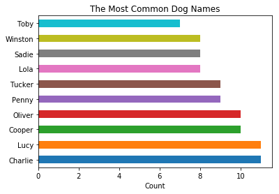
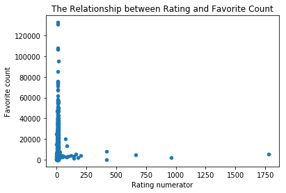
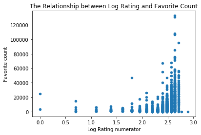

# wrangle-and-analyze-data

In this project, I used python to gather, assess, clean, visualize a dataset. The `wrangle_report.pdf` details the wranging steps in a technical report while below are some of the insights targeted at a non-technical audience.

## Introduction

The WeRateDogs tweets dataset contained names, ratings of dogs etc. as well as favorite counts and retweet counts of each of the tweets. As with any data, we want to gain insights by asking questions based on the data. For example, we may pose questions like “What are the popular dog names?” or “Which tweet had the highest rating?” etc. Analysis of the data produced the following insights:

- The average dog rating numerator was 13.3.
- The tweet with ID 744234799360020481 involving a doggo had the greatest number of retweets (79,515). The dog also had a rating of 13. Also, this tweet (822872901745569793) involving a puppo had the most favorite count (132,810)
- The most popular dog names found in the dataset were Lucy and Charlie (figure 1).
- The higher the rating, the higher the favorite counts.

Figure 1: The Most common dog names among WeRateDogs’ Tweets.

## The relationship between dog rating and favorite counts

We investigate the relationship between the dog rating and tweets favorite counts (figure 2) as well as between the log rating and the favorite count (figure 3). We see that the plot below is affected by outliers. These outliers were usually made up of the ratings of a group(s) of dogs. The relationship between the favorite count and log rating provided a clearer picture (figure 3). It appeared that favorite count increased with the rating although the trend seemed like a curved one

Figure 2: The relationship between the dog rating and tweets favorite counts

Figure 3: The relationship between the log of dog rating and the tweets' favorite counts
